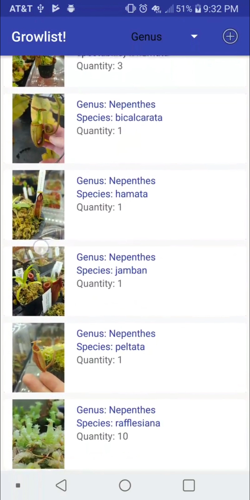
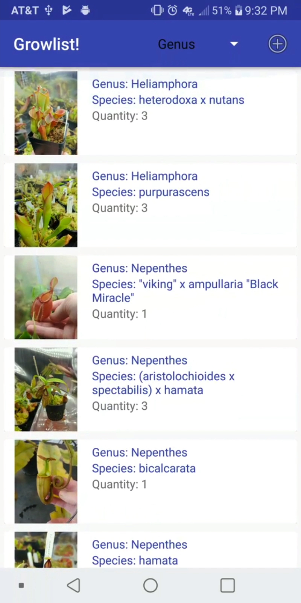
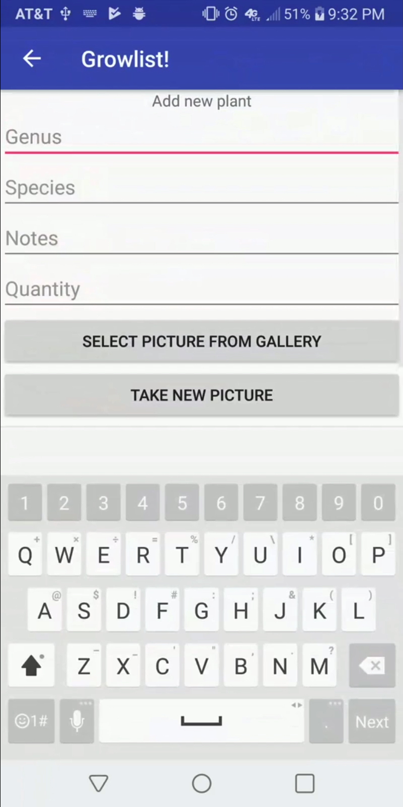

# Growlist, an app for tracking your collection of plants!
**Team name: Growlist-App**
**Team Members: Steven Engel, Alex Wilkinson, Brandon Yen, Casey Lemon**

Introduction
=====
### What it is?
An Android app to track a user's collection of plants along with info related to each individual plant, such as pictures and notes

### Motivation
A group member has a hobby of collecting plants and realized there were no apps available that would make this process easier. So, being able to develop an app for tracking and managing large collections of plants for enthusiasts would solve this problem.

### Our Approach
1. Build core functions of apps to have a minimal functioning app

2. Add individual features
	- **Created displaying of single plants**: We created a UI to just display a single plant entry and basic information about it. This was used as a UI test to see what we wanted the app to look like.
	- **Created list viewing of plants**: We then enabled viewing of multiple plant entries for the user.
	- **Rudimentary data storage options**: Since the core of the app is supposed to store all of the user's plant entries, we needed to create a basic version of a storage system. This was done using Android's Room database (more about in Technology section).

### Conclusions
Because of our approach, we were capable of finishing a majority of the features we orginally planned for. Building our core app, or our app at its most basic version, allowed for us to focus on finishing that quickly then moving onto our more notable features.

Customer Value
==============
No major changes were made from the original project proposal.

Technology
==========
### Changes from status report
**Goals After Minimum Viable System**:
- Fix bugs
- Add updating/deleting of entries from list
- Add image capabilities (From gallery or new picture from camera)

**What works and doesn't work**
After our core system was finished, we began adding more features that we originally planned for while also fixing some bugs. One of our bigger, most hindering bug was a slow down in performance when a user's list got to big, so we needed to fix this before adding other features. After the fix, we began developing features like updating/deleting of entries and more image capabilities.

        

### Tests Ran
While a majority of our team do not have a physical android environment to run our app on, we all would regularly test our app on the Android Emulator built into Android Studio. Running tests on the emulator allowed for quick feedback on various changes to the UI or app functionality. When we had a more stable or more updated version of our app ready, the group member with an Android device would load the app onto their device to test it in a real-world environment.

Also, one of our group members, Steven, asked some hobbyists/enthusiasts in the community to alpha test our app. This allowed for more people with actual android devices to test it and more people than we could've originally planned for too.

### Results of Tests
Within our group, we were able to find quick bugs when developing, however our major bugs were discovered when we were able to get more alpha testers. One of the major bugs discovered was the slowed performance when a list got too big.

Team
====
### Team Member's Roles
Since there is no designated project manager for our team, we have all been contributing like a project manager. This mostly means that if a team member saw something needing to be fixed, then an issue was created and assigned to themselves or the person who could most likely finish it, and was then worked on. This role for each team member, although unorthodox, has been effective with getting issues completed and having each team member contribute.

Project Management
==================
### Updates to schedule:
In our original project proposal, we were projecting for a possible iOS implementation of the app. However, this was not able to be implemented as developing an Android app brought along enough challenges for the four of us within the allotted time frame of this semester. Feature-wise, we were wanting to add a sharing functionality for our app, whether it be to a cloud service or saving it to the device. However, we were unable to finish this in time, but could very easily finish this in future releases.

Reflections
===========
### What went well?
Our team structure has actually been fairly successful. With each member acting as a project manager, we are all contributing to programming, managing, and reaching deadlines. The software aspect has been able to stay on track and we're completing each milestone to our we originally projected it, with minor changes.

### What didn't go well?
Although the team structure was fairly successful, we haven't utilized creating issues for each change to the project we make. This isn't too bad, but it does make the project easier to manage when all issues are in a single place in the project repo.

### Was it a success?
We all agreed that this project was actually successful. We got through nearly all of what we planned for and the parts we didn't get to could easily be implemented in later versions. As a team, we were all able to work together and communicate easily which allowed for a very smooth development process.
